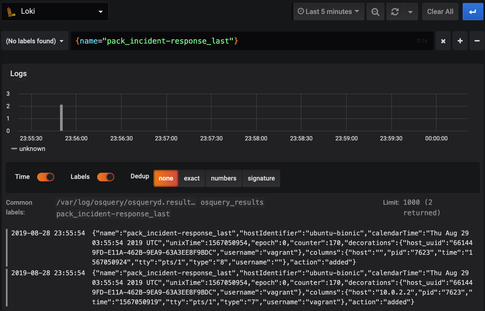
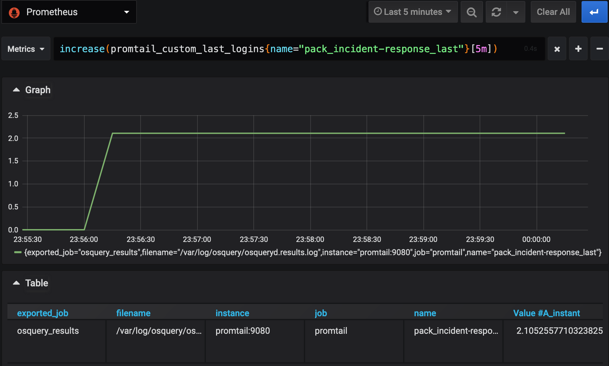
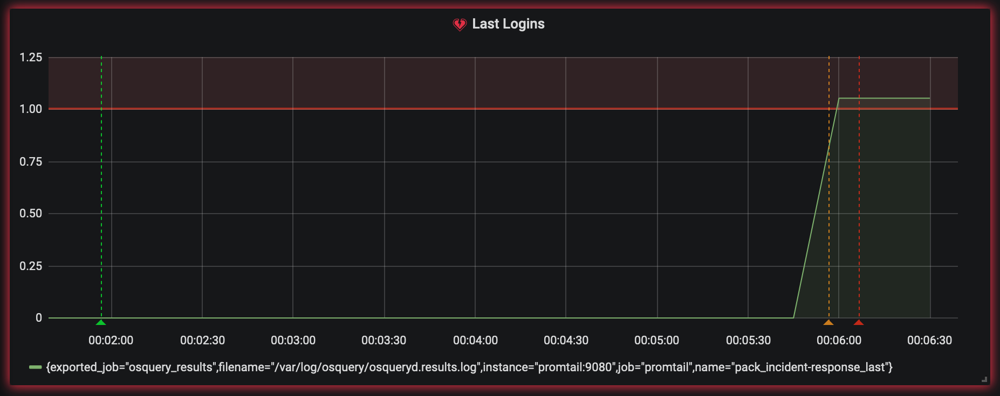

autoscale: true
slidenumbers: true
slidecount: true
slide-dividers: #

# Endpoint Visibility with Osquery and Loki

George Adams IV & Ed Welch

# Use Case

Detecting SSH connections and alerting.

^This is the end goal we'll build towards as we learn a little more along the way.

# Follow Along

[https://github.com/geowa4/learn-loki](https://github.com/geowa4/learn-loki)

^Clone this repo to see slides and run these tools in a Vagrant VM.

# Osquery

## Released by Facebook in 2014

```plaintext
commit 73a32b729403b2f5a7c204b0f7cfb86fdfdd0a85
Author: mike@arpaia.co <mike@arpaia.co>
Date:   Wed Jul 30 17:35:19 2014 -0700

    Initial commit
```

^It had existed internally for some time, but this was when they dumped everything to GitHub.
The next couple commits were fixing repo layout issues from the migration.

# Osquery

## Works on my machine


^One reason I like Osquery is that it runs everywhere.
I can install it on my laptop and my entire fleet.

# Osquery

## SQL interface to your endpoints

```sql
.schema processes
```

```sql
CREATE TABLE processes(
  `pid` BIGINT, `name` TEXT, `path` TEXT, `cmdline` TEXT,
  `disk_bytes_read` BIGINT, `disk_bytes_written` BIGINT,
  ...
  PRIMARY KEY (`pid`)
) WITHOUT ROWID;
```

^If we interrogate the schema for the processes table, we see a familiar sight.

# Osquery

```sql
select max(disk_bytes_read), pid, name, cmdline, cwd from processes;
```

```plaintext
+----------------------+------+------+---------+---------------+
| max(disk_bytes_read) | pid  | name | cmdline | cwd           |
+----------------------+------+------+---------+---------------+
| 10465280             | 5478 | bash | -bash   | /vagrant/demo |
+----------------------+------+------+---------+---------------+
```

^We even get common SQL functions like max, count, etc.

# Osquery

```sql
select p.name, l.port, l.protocol
from processes p inner join listening_ports l on p.pid = l.pid
where p.name = 'VBoxHeadless' and l.port <> 0;
```

```plaintext
+--------------+------+----------+
| name         | port | protocol |
+--------------+------+----------+
| VBoxHeadless | 3000 | 6        |
| VBoxHeadless | 3100 | 6        |
| VBoxHeadless | 9080 | 6        |
| VBoxHeadless | 9090 | 6        |
| VBoxHeadless | 2222 | 6        |
+--------------+------+----------+
```

^Why is a SQL interface nice?
Who remembers how the command to list what processes are listening on which ports?
How about cross-platform?
Not me.
Exploration is easier in SQL than parsing man pages.

# Osquery

```sql
select c.name, p.port, p.host_port
from docker_containers c inner join docker_container_ports p
on c.id = p.id;
```

```plaintext
+--------------------+------+-----------+
| name               | port | host_port |
+--------------------+------+-----------+
| /demo_loki_1       | 80   | 0         |
| /demo_loki_1       | 3100 | 3100      |
| /demo_grafana_1    | 3000 | 3000      |
| /demo_prometheus_1 | 9090 | 9090      |
| /demo_promtail_1   | 9080 | 9080      |
+--------------------+------+-----------+
```

^Of course you can also query Docker resouces.
Here we're doing the Docker container version of the process query eariler.

# Osquery - last Schema

```sql
.schema last
```

```sql
CREATE TABLE last(
  `username` TEXT, `time` INTEGER, `host` TEXT,
  `pid` INTEGER, `tty` TEXT, `type` INTEGER
);
```

^Ok, so we can query things.
We have a job to do: detect SSH connections.
Using the `last` table we can see who's been connecting and when.

# Osquery - last Query

```sql
select * from last;
```

```plaintext
+----------+-------+------+------+------------+-------------------+
| username | tty   | pid  | type | time       | host              |
+----------+-------+------+------+------------+-------------------+
| reboot   | ~     | 0    | 2    | 1566866107 | 4.15.0-52-generic |
| runlevel | ~     | 53   | 1    | 1566866118 | 4.15.0-52-generic |
|          | ttyS0 | 859  | 5    | 1566866119 |                   |
| LOGIN    | ttyS0 | 859  | 6    | 1566866119 |                   |
|          | tty1  | 879  | 5    | 1566866119 |                   |
| LOGIN    | tty1  | 879  | 6    | 1566866119 |                   |
| vagrant  | pts/0 | 5396 | 7    | 1566869034 | 10.0.2.2          |
| vagrant  | pts/1 | 6465 | 7    | 1566870878 | 10.0.2.2          |
|          | pts/1 | 6465 | 8    | 1566870880 |                   |
| vagrant  | pts/1 | 6571 | 7    | 1566870886 | 10.0.2.2          |
|          | pts/1 | 6571 | 8    | 1566870910 |                   |
+----------+-------+------+------+------------+-------------------+
```

^What querying `last` looks like.

# Osquery - Packs

```json
{
  "queries": {
    "last": {
      "query": "select * from last;",
      "interval": "60",
      "platform": "posix",
      "version": "1.4.5",
      "description": "..."
    }
  }
}
```

^Cool, but I'm not going to run that query manually on every server.
With Osquery, you configure "packs" to do that for you.
Here we see we're selecting all the columns from `last` every 60 seconds and only on POSIX machines.

# Osquery - Decorators

```json
{
  "decorators": {
    "load": [
      "SELECT uuid AS host_uuid FROM system_info;",
      "SELECT user AS username FROM logged_in_users ORDER BY time DESC LIMIT 1;"
    ]
  }
}
```

^Ok, I know someone got in, but where was it?
That's where decorators come in.
The results from these queries are appended to every query result.
If you're on AWS, you can add a query for your EC2's tags.

# Osquery - Results

`/var/log/osquery/osqueryd.results.log`

```json
{
  "name": "pack_incident-response_last",
  "hostIdentifier": "ubuntu-bionic",
  "calendarTime": "Tue Aug 27 01:55:13 2019 UTC",
  "decorations": {
    "host_uuid": "2401CCE9-23EA-4D4D-8C84-D5C8437EBE15",
    "username": "vagrant"
  },
  "columns": {
    "host": "10.0.2.2",
    "pid": "6465",
    "time": "1566870878",
    "tty": "pts/1",
    "type": "7",
    "username": "vagrant"
  },
  "action": "added"
}
```

^This is a sample result showing us logging in as `vagrant`.
The result and others from queries defined in our packs can be found in that log file.
One key to remember about the results log is that if the query returns no new data, nothing is written to the log.
Only changes are appended.

# Osquery - Recap

It's been around a while

Cross-platform

It's just SQL

Schedule queries with "packs"

^Next, we'll see how to aggregate those intrusions so we can alert on them.

# Loki

> Prometheus-inspired logging for cloud natives.

Made by Grafana

^High performance cost effective logging inspired by Prometheus and sharing a similar query language *but uses push instead of pull

# Prometheus

Time-series metric collection, storage and querying.

# Prometheus - Push

^TODO: diagram push vs pull

# Prometheus - Pull

^TODO: diagram push vs pull

# Prometheus - Time-series

Queryable via PromQL

```plaintext
sum by (instance) rate(http_requests_total{cluster="us-central1",app="loki"}[5m])
```

^Get the http requests per second for the loki app in the us-central1 datacenter, grouped by `instance`  TODO: Need a more security related query example, count of logins perhaps.

# Prometheus - Scraping

```yaml
scrape_configs:
  - job_name: "promtail"
    static_configs:
      - targets:
          - promtail:9080
```

^Variety of support for service discovery (DNS, Kubernetes) or static config.  Here we're showing a simple config that tells Prometheus to scrape the metrics from a host "promtail" on port 9080.
Prometheus will issue a GET and store the parsed metrics from the response.

# Prometheus - Data Structure

Metrics have labels in addition to values.

```plaintext
rss_attendance_total{track="tech", talk="osquery_loki"} 30
sum(rss_attendance_total{track="tech"}) 100
```

^Labels add dimensions to a metric
The "rss_enjoyment_total" counter can be dimensioned with labels "track" and "talk" for querying the attendance of specific talks, use sum() to aggregate series with different label values.

# Loki - Data Structure

Log entries have labels, too.

```plaintext
{track="tech", talk="osquery_loki"} "best talk ever"
{track="tech", talk="osquery_loki"} "i want to know more"
{track="tech", talk="osquery_loki"} "i hear that one guy runs rocdev"
```

^Loki uses the same structure as Prometheus in that each log entry uses labels.
And the label queries you can do (LogQL) look just like label queries in PromQL. 

^Labels are how data is how logs are indexed in Loki.  Every unique combination of key=value label pairs identify a log stream.  Log streams are aggregated and stored in their own files called chunks.  Using label selectors on queries allows Loki to selectively load chunks for queries.

# Loki - Labels

The matching labels allow us to switch back and forth freely.

^This is a huge benefit that reduces the volume you have to learn and streamlines investigations. 

# Loki - Query

LogQL

```bash
$ logcli query --tail '{name="pack_incident-response_last"}'
2019-08-29T03:01:37Z
{filename="/var/log/osquery/osqueryd.results.log", job="osquery_results", name="pack_incident-response_last"}
{
  "name":"pack_incident-response_last",
  "hostIdentifier":"ubuntu-bionic",
  "calendarTime":"Thu Aug 29 03:01:37 2019 UTC",
  "unixTime":1567047697,
  "epoch":0,
  "counter":115,
  "decorations":{"host_uuid":"661449FD-E11A-462B-9EA9-63A3EE8F9BDC","username":"vagrant"},
  "columns":{"host":"10.0.2.2","pid":"7404","time":"1567047680","tty":"pts/1","type":"7","username":"vagrant"},
  "action":"added"
}
```

^Let's take a look at a LogQL query and try to find our sample result from earlier.
This commonality in query structure is nice, but there's one more link with Prometheus and Loki: metrics extraction.

# Loki - Collection

Promtail

^We've seen how Osquery generates logs.
We've seen how to read logs.
Promtail is how those logs get from your endpoint to Loki.

# Promtail

Forwards logs
_and_
Extracts metrics

^Promtail does something more than just forwarding logs from A to B.
It reads them, parses them, and makes metrics available.

# Promtail - Scraping

```yaml
clients:
  - url: http://loki:3100/api/prom/push
scrape_configs:
  - job_name: osquery
    static_configs:
      - targets:
          - localhost
        labels:
          job: osquery_results
          __path__: /var/log/osquery/osqueryd.results.log
```

^Promtail uses the same service discovery code as prometheus, allowing us to configure a nearly identical scrape config.

# Promtail - Result Reminder

```json
{
  "name": "pack_incident-response_last",
  "hostIdentifier": "ubuntu-bionic",
  "calendarTime": "Thu Aug 29 03:01:37 2019 UTC",
  "unixTime": 1567047697,
  "epoch": 0,
  "counter": 115,
  "decorations": {
    "host_uuid": "661449FD-E11A-462B-9EA9-63A3EE8F9BDC",
    "username": "vagrant"
  },
  "columns": {
    "host": "10.0.2.2",
    "username": "vagrant",
    "type": "7",
    "time": "1567047680",
    "tty": "pts/1",
    "pid": "7404"
  },
  "action": "added"
}
```

^Let's just remind ourselves what the Osquery result looked like before we start processing it with Promtail.

# Promtail - Pipelines

```yaml
pipeline_stages:
  - json:
      expressions:
        timestamp: unixTime
        name: name
  - timestamp:
      source: timestamp
      format: Unix
  - labels:
      name: name
```

^Once we read the log line, we want to pull some things out of it.
First, it's JSON; promtail can also parse with regex, though JSON is much easier.  We define a few fields we are interested in from the JSON
We want to convert the `unixTime` field to `timestamp` and tell Promtail that is Unix format so Loki shows the right time for the event.
Finally, we take the `name` of the pack query and add it as a label.

# Promtail - Metrics

```yaml
pipeline_stages:
  - ...
  - metrics:
      last_logins:
        type: Counter
        description: count last logins
        source: name
        config:
          value: pack_incident-response_last
          action: inc
```

^And this gets us our metric counting how many times `last` finds a new event.

# Promtail - Prometheus

```yaml
scrape_configs:
  - job_name: "promtail"
    static_configs:
      - targets:
          - promtail:9080
```

^Now this is where our Prometheus config from earlier comes in.
We can use Prometheus to scrap Promtail to record that counter.

# Where we are now

Osquery producing results

Promtail forwarding to Loki

Query and tail logs in Loki

Promtail extracting metrics

Prometheus scraping Promtail

^We've covered a lot of ground so let's quickly recap what we've accomplished so far.

# What's left

Charting & alerting

# Grafana

Supports both Promtheus and Loki as data sources

^Charting and alerting are things Grafana does well.
If you're a Prometheus shop, you might have Alertmanager running, and that will work, too.

# Grafana - Loki



^Explore Loki in Grafana to find our event. (Improved support for JSON log entries coming soon)

# Grafana - Prometheus



^Use the same labels to search Prometheus.

# Grafana - Alerting

`increase(promtail_custom_last_logins{name="pack_incident-response_last"}[5m])`



^Make a simple chart on a dashboard and alert if the number of `last` logins increases.

# Putting it all together

^TODO: diagram all the components
